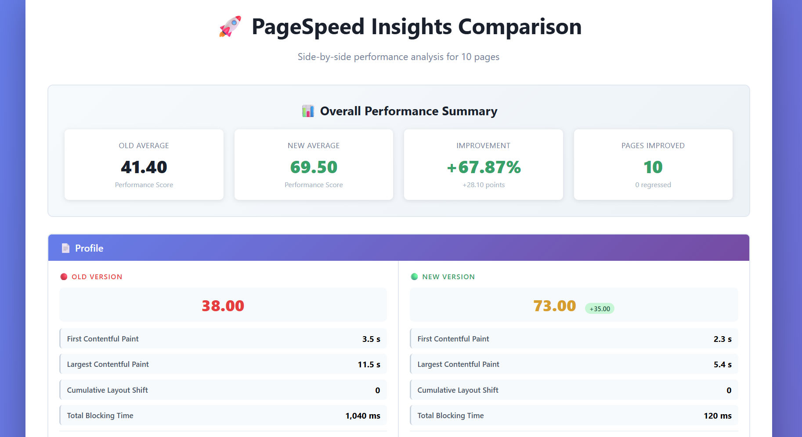

# PageSpeed Insights - Multiple Pages

A TypeScript-based tool that runs Google PageSpeed Insights analysis on multiple pages in parallel and generates comparative performance reports.

## Overview

This project enables bulk performance analysis by running PageSpeed Insights tests on multiple URLs simultaneously. It aggregates and compares performance metrics, accessibility scores, and optimization data across all analyzed pages, making it easy to identify performance trends and issues across your entire site.



## Features

- 🚀 Parallel processing of multiple URLs for faster analysis
- 📊 Fetches performance data from Google PageSpeed Insights API
- 📱 Supports both mobile and desktop analysis
- 📈 Generates comparative HTML reports with performance metrics
- 🔄 Compare performance across multiple pages side-by-side
- 🎨 Clean, formatted output using Handlebars templates
- 🔧 TypeScript for type safety and better developer experience

## Prerequisites

- Node.js (v14 or higher recommended)
- Google PageSpeed Insights API key ([get one here](https://developers.google.com/speed/docs/insights/v5/get-started))

## Installation

1. Clone the repository
2. Install dependencies:

```bash
npm install
```

3. Copy the example environment file:

```bash
cp .env.example .env
```

4. Add your PageSpeed Insights API key to the `.env` file:

```
PSI_API_KEY=your_api_key_here
```

## Usage

Run the tool:

```bash
npm start
```

Build the project:

```bash
npm run build
```

The generated report will be saved in the [`output`](output) directory as `report.html`.

## Project Structure

```
├── src/
│   ├── index.ts              # Main entry point
│   ├── reportTemplate.hbs    # Handlebars template for HTML reports
│   ├── helpers/              # Helper functions
│   └── types/                # TypeScript type definitions
├── output/                   # Generated reports directory
├── .env.example              # Environment variables template
└── tsconfig.json             # TypeScript configuration
```

## Configuration

Environment variables can be configured in the `.env` file:

- `PSI_API_KEY`: Your Google PageSpeed Insights API key

## License

This project is licensed under the MIT License - see the [LICENSE](LICENSE) file for details.

## API Reference

This project uses the [Google PageSpeed Insights API](https://developers.google.com/speed/docs/insights/v5/get-started).
